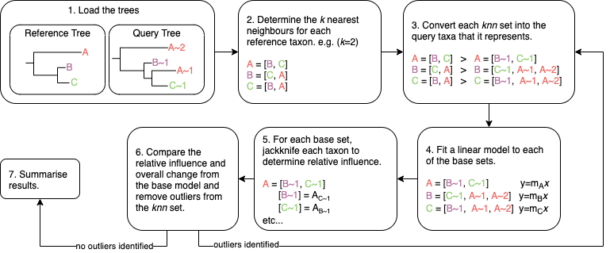

Overview
========

Diagram
-------

Explanation
-----------

Model
^^^^^

Estimator
"""""""""

Regression models (:math:`y=mx+c`) are fit using the Theil-Sen estimator.
The intercept is assumed to be :math:`c=0` as we would expect
points around the :math:`y \approx x \approx 0` region to be very good
representations of correlation between the query and reference trees.
This greatly simplifies the estimator to:

Let :math:`TS_i` be the the Theil-Sen estimate for each data point :math:`i`:

.. math::
   :nowrap:

   \begin{eqnarray}
      TS_i &= \begin{cases}
              0& \text{if $x_i = 0$},\\
              \frac{y_i}{x_i}& \text{otherwise}.
      \end{cases}
   \end{eqnarray}

The Theil-Sen estimate of the gradient is then :math:`m = \text{median}(TS)` for the set :math:`TS`.

Coefficient of determination
""""""""""""""""""""""""""""

The correlation coefficient :math:`R^2` is calculated as follows, where :math:`\hat{y}` is the estimate,
and :math:`\bar{y}` is the mean:

.. math::
   :nowrap:

   \begin{eqnarray}
      R^2 & = 1 - \frac{\sum_i \left(y_i - \hat{y_i}\right)^2}{\sum_i \left(y_i - \bar{y}\right)^2}
   \end{eqnarray}

Mean squared error
""""""""""""""""""

The mean squared error (MSE) is typically reported as the normalised mean squared error (nMSE). The nMSE is
normalised by the standard deviation of the predictor as follows, where :math:`\sigma` is standard
deviation:

.. math::
   :nowrap:

   \begin{eqnarray}
      nMSE & = \sqrt{\frac{\text{MSE}(y, \hat{y})}{\sigma(y)}}
   \end{eqnarray}

Relative influence function
"""""""""""""""""""""""""""

The relative influence of jackknifing a query taxon :math:`u_i` from the full set of taxa size :math:`n`
is calculated as follows:

.. math::
   :nowrap:

   \begin{eqnarray}
      u_i & = \frac{(n-1)\left(\bar{x}-\text{MSE}_i\right)}{\sqrt{\frac{\sum_i \left(\left(n-1)(\bar{x} - \text{MSE}_i\right)\right)^2}{n-1}}}
   \end{eqnarray}

